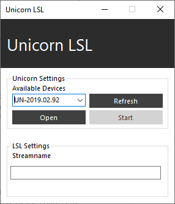

# Unicorn LSL interface

The Unicorn LSL Interface is an application that allows users to acquire data from the Unicorn and forward the data to external applications using the labstreaminglayer.

## Sending data via UDP

The Unicorn LSL Interface is listed in the Unicorn Suite in the “DevTools” section. Open the “UnicornLSL.exe” from the folder to start the Unicorn LSL Interface.

Available Unicorn devices are listed in the dropdown box in the Unicorn Settings. The list of available devices can be updated by clicking “Refresh”. Enter the stream-name for the labstreaminglayer stream. The stream is named “Unicorn” if it is not filled. Select a device from the serial list and click “Open” to connect to the Unicorn. The stream-name can’t be modified after connecting to a Unicorn. Click “Start” to initiate the data transmission. Click “Stop” to terminate data transmission. Click “Close” to disconnect from the Unicorn.

 

## Receiving data

The labstreaminglayer is supported by a variety of programming languages and applications. Visit the [labstreaminglayer](https://github.com/sccn/labstreaminglayer/) repository for more information.