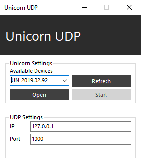

# Unicorn UDP interface

The Unicorn UDP Interface is an application that allows users to acquire data from the Unicorn and forward the data using the UDP networking protocol.

## Sending data via UDP

The Unicorn UDP Interface is listed in the Unicorn Suite in the “DevTools” section. Open the “UnicornUDP.exe” from the folder to start the Unicorn UDP Interface.

Available Unicorn devices are listed in the dropdown box in the Unicorn Settings. The list of available devices can be updated by clicking “Refresh”. Enter the IP address of the target machine and a port under the UDP Settings. Select a device from the serial list and click “Open” to connect to the Unicorn. The IP address and port can’t be modified after connecting to a Unicorn. Click “Start” to initiate the data transmission. Click “Stop” to terminate data transmission. Click “Close” to disconnect from the Unicorn and close the UDP socket.

<p align="center">
<br/>
</p>

## Receiving data in C#

The following example code describes how to receive data from the Unicorn UDP Interface in C#:

```
using System;
using System.Net;
using System.Net.Sockets;

namespace UnicornUDPReceiver
{
    class Program
    {
        static void Main(string[] args)
        {
            Console.WriteLine("Unicorn UDP Receiver Example");
            Console.WriteLine("----------------------------");
            Console.WriteLine();
            try
            {
                //define an IP endpoint
                Console.Write("Destination port: ");
                int port = Convert.ToInt32(Console.ReadLine());
                IPAddress ip = IPAddress.Any;
                IPEndPoint endPoint = new IPEndPoint(ip, port);
                Console.WriteLine("Listening on port '{0}'...",port);

                //initialize upd socket
                Socket socket = new Socket(AddressFamily.InterNetwork, SocketType.Dgram, ProtocolType.Udp);
                socket.Bind(endPoint);
                byte[] receiveBufferByte = new byte[1024];
                float[] receiveBufferFloat= new float[receiveBufferByte.Length / sizeof(float)];

                //acquisition loop
                while (true)
                {
                    int numberOfBytesReceived = socket.Receive(receiveBufferByte);
                    if (numberOfBytesReceived > 0)
                    {
                        //convert byte array to float array
                        for (int i = 0; i < numberOfBytesReceived / sizeof(float); i++)
                        {
                            receiveBufferFloat[i] = BitConverter.ToSingle(receiveBufferByte, i * sizeof(float));
                            if(i+1< numberOfBytesReceived / sizeof(float))
                                Console.Write("{0},", receiveBufferFloat[i].ToString("n2"));
                            else
                                Console.WriteLine("{0}", receiveBufferFloat[i].ToString("n2"));
                        }
                    }
                }
            }
            catch(Exception ex)
            {
                Console.WriteLine("Error: {0}", ex.Message);
                Console.WriteLine("Press ENTER to terminate the application.");
                Console.ReadLine();
            }
        }
    }
}
```

## Receiving data in any other programming language

Data can be received in any programming language supporting UDP sockets. The Unicorn UDP Interface sends data packages at a sampling rate of 250 Hz. Each payload consists of data from 17 channels from the Unicorn (8 channels EEG, 3 channels Accelerometer, 3 channels Gyroscope, Battery Level, Counter, Validation) formatted as float. Therefore, every Payload consists of 68 bytes (17 channels * 4 bytes [float]). In the receiving application, the receiving socket has to listen on the port configured in the Unicorn UDP Interface. Whenever a payload holding all 68 bytes is received, it must be converted to a float array. The byte array is structured as following:

<p align="center">

| 1 | 2 | 3 | 4 | 5 | 6 | 7 | 8 |
|---|---|---|---|---|---|---|---|
| EEG 1 | EEG 1 | EEG 1 | EEG 1 | EEG 2 | EEG 2 | EEG 2 | EEG 2 |
| 9 | 10 | 11 | 12 | 13 | 14 | 15 | 16 |
| EEG 3 | EEG 3 | EEG 3 | EEG 3 | EEG 4 | EEG 4 | EEG 4 | EEG 4 |
| 17 | 18 | 19 | 20 | 21 | 22 | 23 | 24 |
| EEG 5 | EEG 5 | EEG 5 | EEG 5 | EEG 6 | EEG 6 | EEG 6 | EEG 6 |
| 25 | 26 | 27 | 28 | 29 | 30 | 31 | 32 | 
| EEG 7 | EEG 7 | EEG 7 | EEG 7 | EEG 8 | EEG 8 | EEG 8 | EEG 8 | 
| 33 | 34 | 35 | 36 | 37 | 38 | 39 | 40 | 
| ACC X | ACC X | ACC X | ACC X | ACC Y | ACC Y| ACC Y | ACC Y | 
| 41 | 42 | 43 | 44 | 45 | 46 | 47 | 48 | 
| ACC Z | ACC Z | ACC Z | ACC Z | GYR X | GYR X  | GYR X  | GYR X  | 
| 49 | 50 | 51 | 52 | 53 | 54 | 55 | 56 |
| GYR Y | GYR Y | GYR Y | GYR Y | GYR Z | GYR Z | GYR Z | GYR Z |
| 57 | 58 | 59 | 60 | 61 | 62 | 63 | 64 |
| BAT | BAT | BAT | BAT | CNT | CNT | CNT | CNT |
| 65 | 66 | 67 | 68 |
| VALID | VALID | VALID | VALID |

</p>